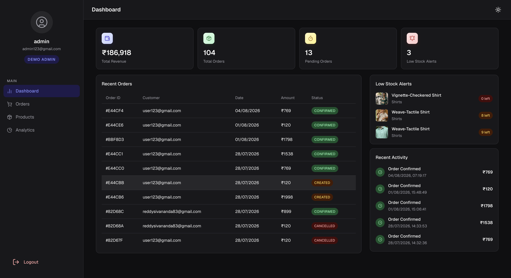
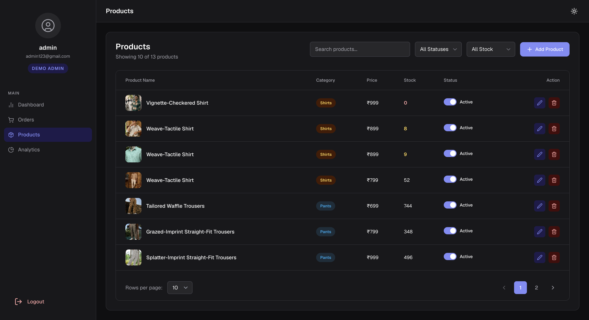
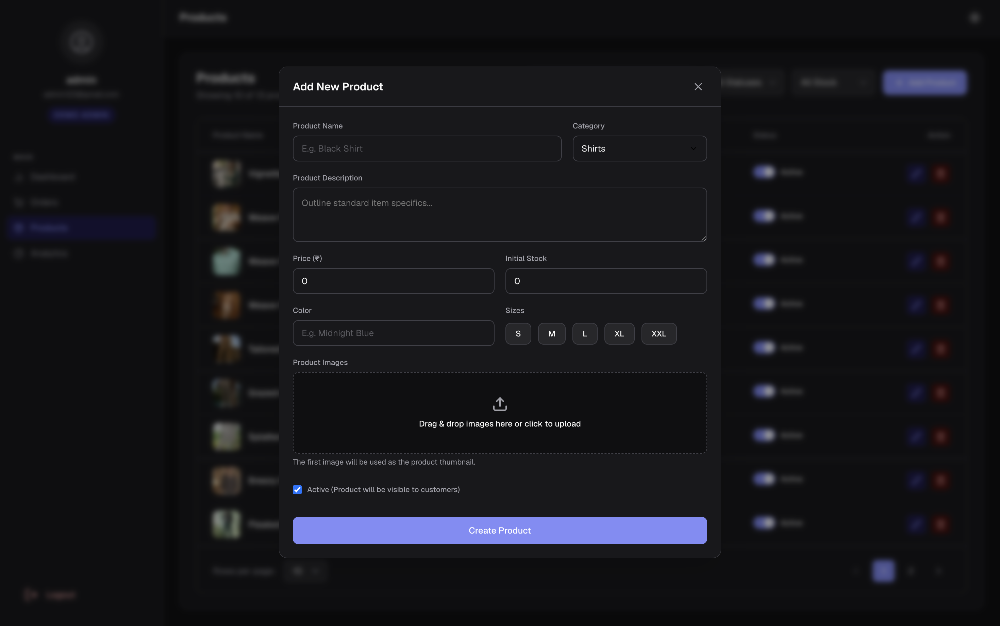
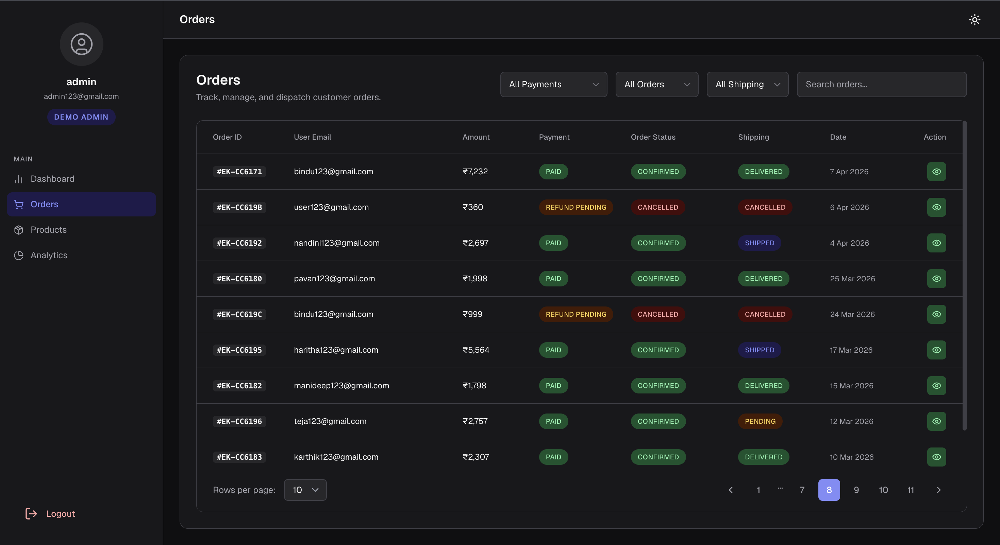
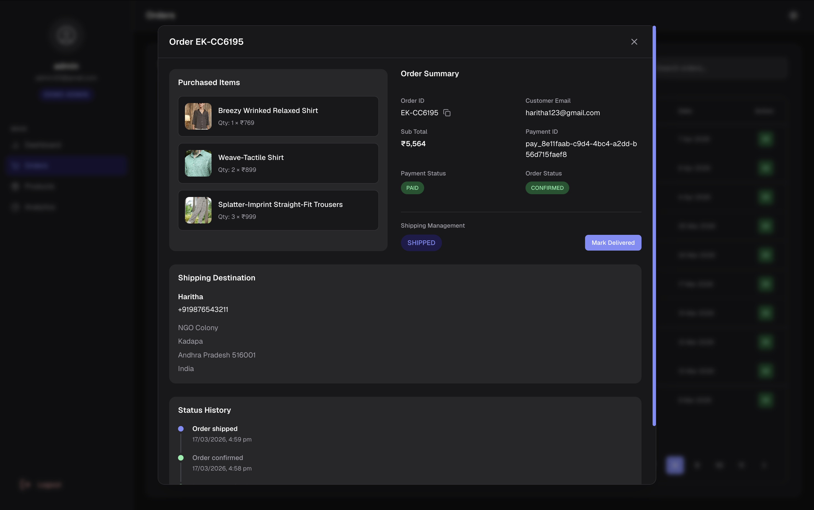
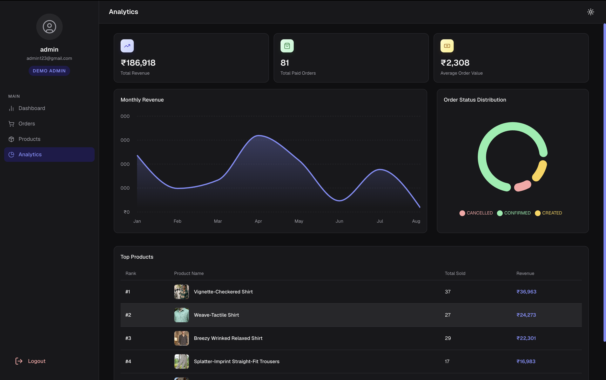

# eKart Admin Panel

Admin dashboard for managing products, orders, inventory, and analytics in the eKart ecommerce platform.

## Live Demo

- **Admin Panel:** https://ekart-admin-dashboard.pages.dev/
- **System Overview & Credentials:** https://ekart-system.pages.dev/ (Contains project info, GitHub links for all eKart services, and credential-loaded URLs for easy testing)

---

## Related Repositories

- [eKart Frontend](https://github.com/sn0914r/ekart-frontend)
- [eKart Backend](https://github.com/sn0914r/ekart-backend)
- [Payment Orchestration Engine](https://github.com/sn0914r/payment-orchestration-engine)
- [Email Worker Service](https://github.com/sn0914r/email-worker-service)

---

## Features

### Authentication & Access Control

- JWT-based authentication
- Role-Based Access Control (RBAC)
- Protected admin routes
- Persistent admin session state

### Dashboard

- Revenue, orders, and stock metrics
- Sales and revenue charts
- Low stock alerts

### Product Management

- Create, update, and delete products
- Multi-image uploads
- Product category and stock management

### Order Management

- View and update orders
- Order status tracking
- Customer and shipping details

### User Interface

- Responsive admin dashboard
- Dark/Light mode support
- Toast notifications

---

## Tech Stack

| Category | Technology |
|----------|------------|
| Frontend | React, Vite, React Router |
| State Management & Data Fetching | Zustand, TanStack Query |
| Forms & Validation | React Hook Form, Zod |
| UI & Styling | Bootstrap, Emotion, Lucide React |
| Charts | Recharts |

---

## Folder Structure

```txt
src/
├── app/
│   ├── pages/
│   ├── store/
│   ├── App.css
│   ├── App.jsx
│   ├── AppRouter.jsx
│   └── Providers.jsx
│
├── assets/
│
├── constants/
│
├── lib/
│   ├── apiClient.js
│   └── queryClient.js
│
├── modules/
│   ├── analytics/
│   ├── auth/
│   ├── dashbaord/
│   ├── orders/
│   └── products/
│
├── shared/
│   ├── components/
│   ├── hooks/
│   └── layout/
│
├── utils/
│
└── main.jsx
```

---

## Environment Variables

Create a `.env` file in the root directory:

```env
VITE_API_BASE_URL=
VITE_NODE_ENV=development
```

---

## Installation

```bash
git clone https://github.com/sn0914r/ekart-admin-panel.git

cd ekart-admin-panel

npm install

npm run dev
```

---

## Screenshots

### Login


### Dashboard



### Products



### Add Product



### Orders



### Order Details



### Analytics



---

## Security

- JWT authentication
- Role-Based Access Control (RBAC)
- Protected admin routes
- Automatic token refresh handling
- Authenticated API requests using Bearer tokens
- Form validation using Zod
